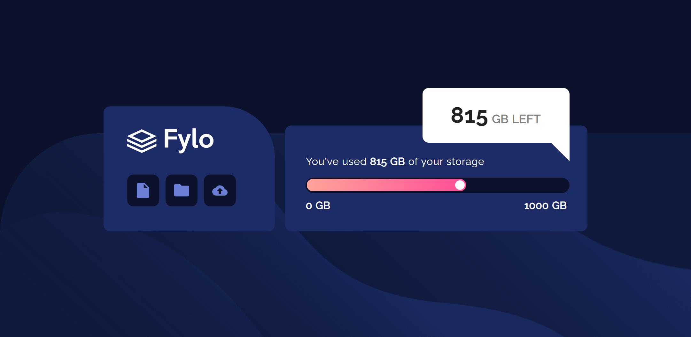
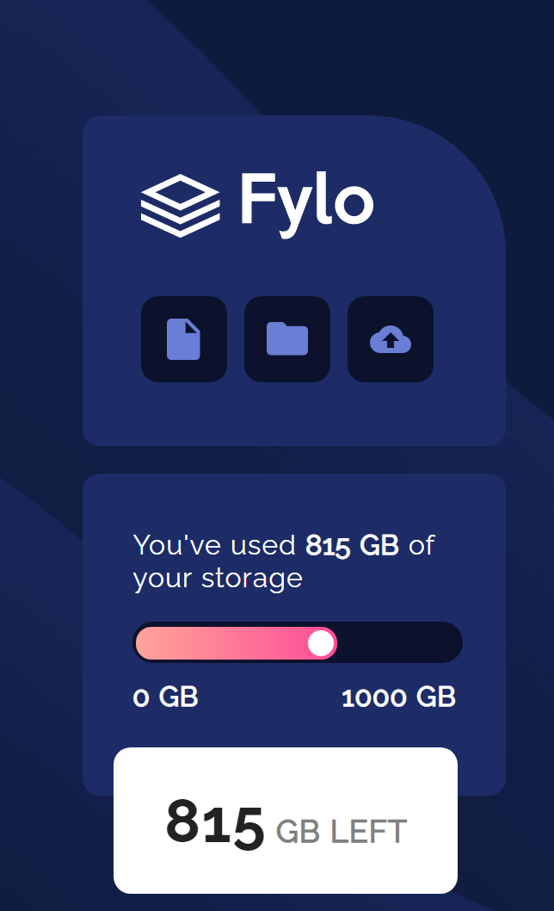

# Frontend Mentor - Fylo data storage component solution

This is a solution to the [Fylo data storage component challenge on Frontend Mentor](https://www.frontendmentor.io/challenges/fylo-data-storage-component-1dZPRbV5n). Frontend Mentor challenges help you improve your coding skills by building realistic projects. 

## Table of contents

- [Overview](#overview)
  - [The challenge](#the-challenge)
  - [Screenshot](#screenshot)
  - [Links](#links)
- [My process](#my-process)
  - [Built with](#built-with)
  - [What I learned](#what-i-learned)
  - [Continued development](#continued-development)
  - [Useful resources](#useful-resources)
- [Author](#author)

## Overview

### The challenge

Users should be able to:

- View the optimal layout for the site depending on their device's screen size

### Screenshot

### Links

- Solution URL: [Add solution URL here](https://your-solution-url.com)
- Live Site URL: [Add live site URL here](https://your-live-site-url.com)

## My process

### Built with

- CSS custom properties
- CSS Grid
- Mobile-first workflow

### What I learned

- I learnt more in depth of using the css flex box

### Continued development
- I'm going to spend more time mastering background positioning techniques coz it gave me some hardship in this project.

### Useful resources

- [Example resource 1](https://www.w3schools.com) - This helped me for the general learning of everything about web design. 

## Author

- Website - [Add your name here](https://www.Github/Gito125)
- Frontend Mentor - [@yourusername](https://www.frontendmentor.io/profile/Gito125)
